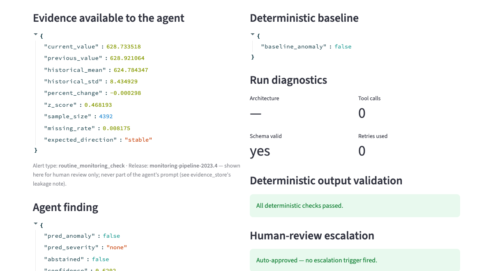
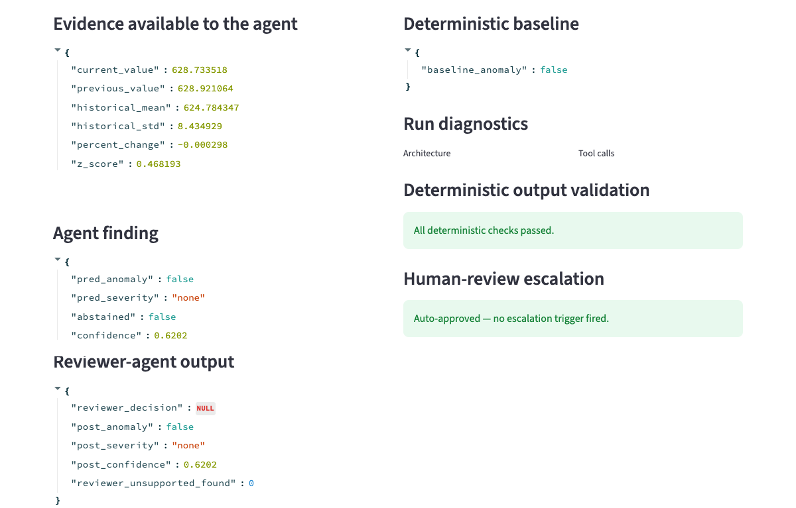
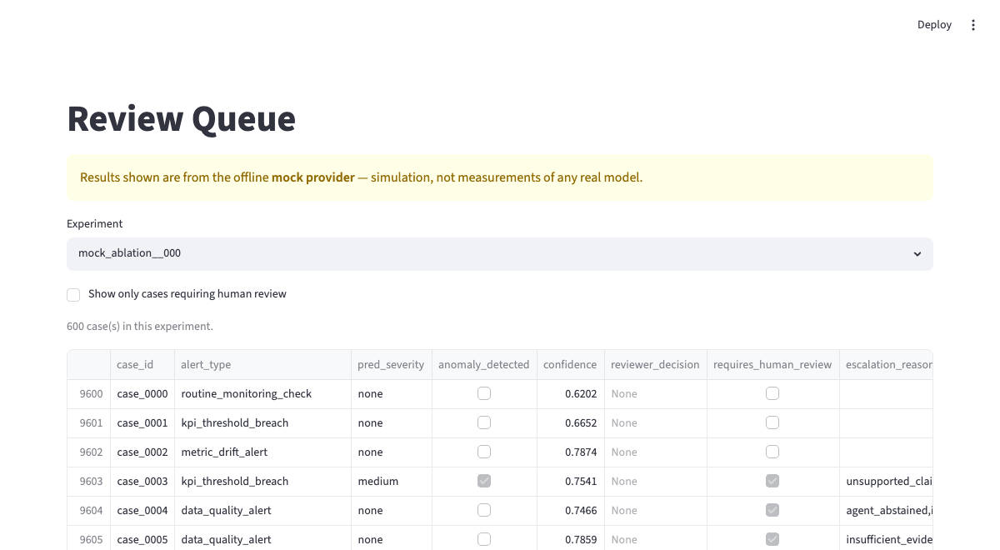
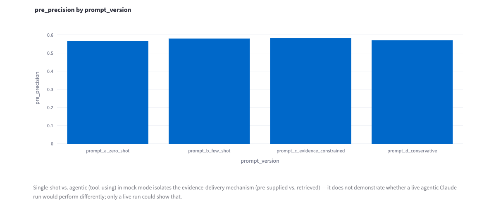
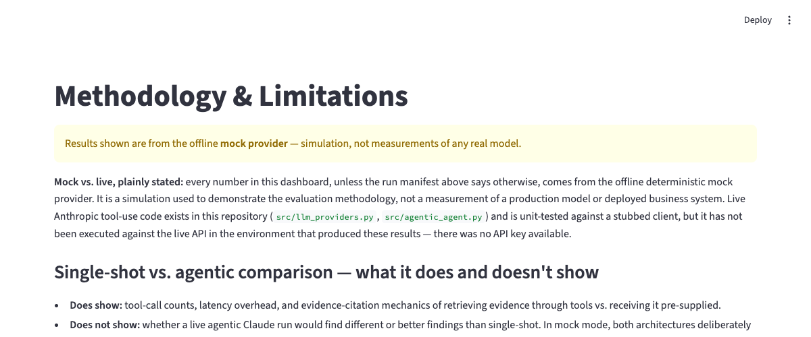

# Agentic AI Evaluation Platform

A reproducible prototype of an evidence-grounded, Claude-enabled analytical
review workflow — a schema-constrained QA agent, an independent reviewer
agent, deterministic validation, and human-in-the-loop escalation, evaluated
on synthetic model-monitoring cases. It also runs a fair, documented
comparison between a **single-shot** architecture and an **agentic
(tool-using)** one that retrieves evidence on demand.

> **Mock-provider disclosure.** Canonical results in this README, the
> dashboard, and `reports/research_summary.md` come from a deterministic
> offline mock provider, used to demonstrate the evaluation methodology.
> They are not measurements of a production model or deployed business
> system. See [§15](#15-mock-versus-live-disclosure).

An analyst-facing review prototype that retrieves supporting evidence,
produces a structured finding, validates it, and routes uncertain cases to
human review.



**[View workflow](#6-architecture) · [View sample finding](#8-inputs-and-outputs) · [Run locally](#16-quick-start)**

```
Monitoring case → Evidence retrieval → Structured finding
→ Reviewer → Deterministic validation → Human escalation
```

| | |
|---|---|
| **Who's it for** | Analysts or model reviewers evaluating monitoring anomalies |
| **What goes in** | A synthetic case identity (single-shot: pre-supplied evidence; agentic: retrieved via tools) |
| **What comes out** | A schema-validated finding citing specific evidence IDs |
| **Where the LLM acts** | Drafting the finding and (in the agentic condition) deciding which evidence to retrieve |
| **Where deterministic logic acts** | 7 independent validation checks + a rule-based baseline, none of them an LLM |
| **When a human reviews** | Whenever an explicit escalation policy fires — severity, low confidence, unsupported claims, failed validation, and more (§12) |

## 1. Project overview

This is a working prototype, not a production system: a synthetic
model-monitoring review case goes in, and a schema-validated finding —
checked by a reviewer agent, deterministic validation, and an explicit
human-escalation policy — comes out. 600 synthetic cases, 15 documented
failure-mode scenarios, 127 passing tests, and two architectures (single-shot
and agentic/tool-using) are all reproducible offline with no API key.

## 2. Intended user

Designed as a reference implementation for analysts or model reviewers who
need to evaluate monitoring anomalies, retrieve supporting evidence, compare
findings across prompt conditions and architectures, and retain a clear
human-decision trail. No real analyst has used this in production — it is a
demonstration of the workflow, not a deployed tool.

## 3. Problem

Reviewing model-monitoring anomalies is judgment-heavy: separating true
anomalies from noise, recognizing seasonality and recovery effects, catching
metric-definition changes, assembling the evidence that actually supports a
conclusion, and leaving a clear record of who decided what. Naive magnitude
thresholds produce both false alarms and missed shifts (see §6).

## 4. Workflow before the tool

No measured baseline is claimed. Qualitatively, this kind of review tends to
be manual and inconsistent: a reviewer applies informal heuristics to a
metric history and writes up a finding with whatever evidence and structure
they have time for, with no standard way to compare one reviewer's judgment
to another's or to a transparent rule.

## 5. What the prototype supports

- A synthetic case and evidence model with stable, ID-addressable evidence
  items (§9).
- A schema-constrained QA agent that separates observed facts from
  hypotheses and cites evidence IDs (§10).
- An independent reviewer agent with a genuinely distinct prompt and role —
  it checks the first agent's work, it doesn't repeat it (§11).
- A transparent deterministic baseline, independent of any LLM (§8, §11).
- Deterministic *output* validation — evidence-ID existence, numeric
  consistency, escalation-rule compliance — layered on top of Pydantic
  schema validation (§11).
- An explicit, single-function human-escalation policy (§12).
- Two architectures — single-shot and agentic (tool-using) — run on the
  same cases for a fair, documented comparison (§7).
- Calibration, failure-mode, cost/latency, and escalation-precision/recall
  analysis (§13, §14).
- A 9-page Streamlit dashboard, including a Review Queue and a Methodology
  & Limitations page that keeps the mock-vs-live distinction visible.

## 6. Architecture

```
Synthetic review case
      │
      ▼
Evidence store (stable, ID-addressable items)
      │
      ├── single-shot ──► all evidence pre-rendered in one prompt
      │                          │
      └── agentic ──► evidence-retrieval tools, called on demand
                                 │
                                 ▼
                        Primary QA agent
                     (schema-validated finding,
                      cites evidence_ids)
                                 │
                                 ▼
                     Independent reviewer agent
                     (checks evidence support,
                      unsupported claims, severity)
                                 │
                                 ▼
                  Deterministic output validation
                (evidence-ID existence, numeric
                 consistency, tool-call limit,
                 schema conformance)
                                 │
                                 ▼
                    Escalation policy decision
                 (auto-approve or human review)
                                 │
                                 ▼
                     Evaluation dashboard
```

The agent assembles or retrieves evidence, renders a prompt, calls a
provider with a bounded retry loop, and validates the returned JSON against
a strict Pydantic schema (`AgentFinding`, `src/schemas.py`).

## 7. Single-shot versus agentic design

Both architectures draw from the **identical** per-case evidence set
(`src/evidence_store.py`) — they differ only in *how* the agent gets it:

- **Single-shot** (`src/agent.py::QAAgent`): the whole case's evidence is
  pre-rendered into one prompt, including a compact `evidence_catalog` of
  evidence IDs the agent can cite. One model call (plus bounded
  schema-correction retries).
- **Agentic / tool-using** (`src/agentic_agent.py::ToolUsingQAAgent`): the
  agent receives only a minimal, non-leaking case identity (case ID, model,
  metric, segment, quarter, release version — no evidence, no `alert_type`)
  and must call tools (`src/evidence_tools.py`) to retrieve what it needs,
  bounded to 6 tool calls per attempt.

**Why compare them this way:** giving the two conditions different
underlying decision logic would confound "delivery mechanism" with "model
quality." In mock mode, both conditions deliberately **share the same
underlying decision policy** (`MockProvider._decide`), so the comparison
isolates the evidence-delivery mechanism — this is a controlled experiment,
not a claim that one architecture is smarter. See the real, reproducible
result in §14.

**When single-shot is sufficient:** the evidence for a case is small,
bounded, and known in advance — as it is here. Pre-rendering it is simpler,
faster (no tool round-trips), and cheaper.

**When an agentic workflow is justified:** the evidence space is large,
conditional, or expensive to assemble up front, so retrieving only what's
relevant is worth the extra latency and complexity — or the tool interface
itself is a requirement (e.g., integrating with a live system a prompt can't
just embed).

## 8. Inputs and outputs

**Input** (single-shot): a case's engineered features, chart summary,
deterministic QA findings (optional), and an `evidence_catalog` of IDs.
**Input** (agentic): a minimal case identity; evidence is fetched via tools.

**Output**: a single `AgentFinding` JSON object — see §10 for the schema.

Real logged example (`outputs/sample_agent_outputs.json`, case_0008,
`mock_main__000`): an anomaly the agent detected with a high
unsupported-claim risk, which the reviewer agent then caught and revised —
confidence downgraded from 0.7398 to 0.5898 after the reviewer flagged an
unsupported claim.

## 9. Evidence tools

`src/evidence_store.py` restructures each case's already-computed data
(metric snapshot, historical baseline, a universal validation rule, release
notes, segment comparison, seasonality and recovery indicators, and
triggered deterministic checks) into stable, ID-addressable items — no new
data is invented. `src/evidence_tools.py` exposes them as explicit,
argument-validated tools:

| Tool | Returns |
|---|---|
| `list_available_evidence(case_id)` | evidence_id/kind/title for every item |
| `get_case_metrics(case_id)` | current-quarter statistics |
| `get_historical_baseline(case_id)` | historical mean/std, rolling stats |
| `get_release_notes(case_id)` | release version + definition-change signal |
| `get_validation_rule(case_id)` | the (universal) z-score threshold rule |
| `get_segment_comparison(case_id)` | cross-segment deviation |
| `get_evidence_item(case_id, evidence_id)` | any specific item by ID |

Every tool call is argument-validated, logged (`ToolExecutor.call_log`), and
bounded (`max_calls`, default 6 — enforced by `ToolExecutor`, not just
requested of the model). Missing evidence and invalid IDs return a
structured `{"error": ...}` rather than raising.

**Note on `get_validation_rule`:** the target sketch for this tool took an
`alert_type` argument. `alert_type` is derived 1:1 from `scenario_type` for
several scenarios (e.g. `segment_deviation_alert` only ever occurs on
ground-truth-anomalous cases) and would leak the answer if ever shown to the
agent. The validation rule in this dataset is deliberately universal — the
same threshold applies to every case — so this tool takes `case_id` only,
for interface consistency, and ignores it functionally. `alert_type` is
still recorded in `outputs/case_level_results.jsonl` and shown in the
Streamlit Review Queue **for human display only**.

**Claude tool use — implemented, unit-tested, not yet executed live.** The
real Anthropic tool-use loop (`AnthropicProvider.complete_with_tools`,
`src/llm_providers.py`) is written and verified against the installed
`anthropic` SDK's real type shapes (`ToolParam`, `ToolUseBlock`,
`ToolResultBlockParam` — confirmed against `anthropic==0.117.0`). It is
unit-tested end to end against a stubbed client that exercises the exact
control flow (tool_use → tool_result → ... → forced final schema call,
including the tool-call-limit and provider-error paths) — see
`tests/test_tool_use_loop.py`. **It has not been executed against the live
API in the environment that produced this repository's results**, because
no `ANTHROPIC_API_KEY` was available. The offline mock provider
independently proves the same tool-retrieval/limit/citation interface
(`MockProvider.complete_with_tools`) by driving the real `ToolExecutor`
against the real evidence store with a scripted retrieval policy.

## 10. Structured schemas

`AgentFinding` (Pydantic, `extra="forbid"`): `anomaly_detected`, `severity`,
`anomaly_type`, `summary`, `observations` (facts only), `possible_explanations`
(hypotheses only, never asserted as fact), `evidence_ids` (must reference
real items — checked by deterministic validation, not the schema, since that
needs external state), `supporting_evidence`, `confidence_score` (validated
in [0,1]), `evidence_sufficiency`, `unsupported_claim_risk`,
`requires_human_review`, `abstained`, `abstention_reason`.

`ReviewerOutput`: `review_decision` (approve/revise/reject),
`revised_anomaly_detected/severity/anomaly_type`, `unsupported_claims_found`,
`missing_evidence`, `revised_confidence`, `requires_human_review`.

Both use Pydantic v1 (the installed version); `schemas.py` isolates the
version-specific calls behind small compatibility shims.

## 11. Reviewer and deterministic validation

**Reviewer agent** (`src/reviewer_agent.py`): a genuinely distinct prompt and
role (`config/prompts.yaml:reviewer`) — it is handed the first agent's
finding and the evidence, and checks whether the finding is supported,
whether cited evidence exists, and whether severity/confidence are
appropriate. It does not repeat the primary classification blind, and it is
not described as "independent" merely because it uses a different prompt —
it genuinely evaluates the first agent's output rather than reproducing it.

**Deterministic output validation** (`src/output_validation.py`, 7 checks,
independent of any LLM):

1. `schema_conformance` — did the output pass Pydantic validation?
2. `evidence_ids_exist` — does every cited ID exist in the case's store?
3. `numeric_consistency` — do quoted values match the real evidence?
4. `high_severity_requires_review` — is severity="high" flagged for review?
5. `unsupported_causal_wording` — is a cause asserted with no causal evidence?
6. `reviewer_compatibility` — is the reviewer's decision internally consistent?
7. `tool_call_limit` — did the run stay under the configured tool budget?

Every check returns a structured pass/fail result; none are hidden — the
Streamlit Case Review page and the CSV output both surface all of them, not
just the failures.

## 12. Human-review policy

`src/escalation.py::decide_escalation` is the single, explicit,
independently-tested function deciding whether a case is auto-approved or
escalated. It escalates on **any** of: schema-validation failure,
severity="high", confidence below a configurable threshold (default 0.6),
agent abstention, insufficient/limited evidence sufficiency, an unsupported
causal claim, a non-"approve" reviewer decision, any failed deterministic
check, or exceeding the tool-call budget.

Human review itself (`src/review_store.py`, a local SQLite file) supports
approve / reject / revise / uncertain, corrected fields, and reviewer notes,
wired to a working Streamlit form (Case Review page). **Disclosure:** this
is a single local SQLite file — not multi-user, not persistent across
environments, and not access-controlled. It is a research-prototype store,
not a production review system.

## 13. Evaluation methodology

`src/evaluators.py` computes precision/recall/F1/specificity/balanced
accuracy, severity confusion, abstention/selective accuracy, schema
compliance, a documented surface-pattern unsupported-claim detector,
calibration (Brier score, expected calibration error), and — new in this
pass — average tool calls, evidence-citation accuracy, deterministic
validation pass rate, and escalation precision/recall against a documented,
generation-time escalation-expectation rule (`ground_truth_expected_escalation`,
computed once in `data_generation.py`, never adjusted after seeing model
output). `src/statistical_tests.py` provides bootstrap CIs, McNemar's test,
paired permutation tests, Cohen's h, and Benjamini-Hochberg correction.

## 14. Results

All numbers below are from the offline mock provider, reproduced by
`python -m src.reporting`; full tables live in `outputs/` and
`reports/research_summary.md`.

**Two different F1 numbers appear below — here is exactly what each one
is,** to avoid the two being read as comparable or as one "beating" the
other:

- **Agent F1** is the schema-constrained QA agent's decision F1 (precision/
  recall on `anomaly_detected` vs. ground truth), for a *specific named
  condition* (prompt variant × deterministic-evidence on/off × reviewer
  on/off).
- **Rule-baseline F1** is a *separate, always-on reference measurement*: a
  simple, transparent, magnitude-only rule (`src/deterministic_checks.py`)
  scored against the same 600 cases, run once per experiment regardless of
  which agent condition is active. It is not a target the agent is trying
  to beat, and the agent is not "compared against" it in the sense of a
  leaderboard — it exists so a reader can judge how hard the dataset is
  under a naive detector.

**Full-evidence single-shot condition** (evidence-constrained prompt,
deterministic evidence on, reviewer on; `mock_main`, 600 cases) — chosen
here because it combines every evidence/quality feature this study tests,
not because it has the highest F1 among the 16 `mock_main` conditions:
agent precision 0.593, recall 0.503, **agent F1 0.545**; false-positive
rate 0.384; unsupported-claim rate 0.043; schema compliance 1.000; ECE
0.120; abstention 0.063; deterministic-validation pass rate 0.788;
escalation rate 0.572. **Rule-baseline F1 on the same 600 cases: 0.586.**

**To be explicit: the agent's F1 (0.545) is lower than, not higher than or
equal to, the rule baseline's F1 (0.586) here** — and that pattern holds
across all 16 `mock_main` conditions (agent F1 ranges 0.533–0.582; the
baseline is a constant 0.586 for all of them, since it doesn't depend on
prompt/evidence/reviewer settings). This is not a failure hidden in fine
print: verified directly from `outputs/case_level_results.jsonl`, the
magnitude-only baseline predicts "anomaly" on **100% of the
`false_positive_trap` and `metric_definition_change` cases — both scenario
types where ground truth is never an anomaly** — so its F1 looks strong
only because it also gets the easier majority of cases right. Its
per-scenario F1 on those two trap types is 0.000. Raw decision F1 is one
axis among several this study evaluates; it is not, by itself, evidence
that the agent is better or worse than the simple rule — the unsupported-
claim rate, calibration, evidence traceability, and escalation-precision/
recall numbers above are what this study is actually built to compare.
**Important:** because every number in this section comes from the
deterministic mock provider, this F1 relationship is a property of how the
mock's decision policy is configured (it deliberately includes realistic
error and miscalibration rates), not a finding about how a real Claude
model would compare to this rule — only a live run could show that.

**Single-shot vs. agentic architecture comparison**
(`mock_architecture_comparison`, 600 cases, paired by case): decision
accuracy 0.557 (single-shot) vs 0.572 (agentic), McNemar p=0.503 — **not
statistically significant**. This is the expected, correct result of a
*controlled* comparison: both conditions deliberately share the identical
underlying mock decision policy, so the only thing that differs between
them is the evidence-delivery mechanism (pre-supplied vs. tool-retrieved),
not decision quality. Average tool calls: 0.00 vs 3.36. Average latency:
0.301s vs 0.366s. Evidence-citation accuracy: 1.000 for both. **This result
should not be read as evidence that the agentic architecture improves — or
degrades — model quality.** What it does demonstrate is that the
tool-retrieval, evidence-citation, and tool-call-limit machinery all work
correctly end to end under a controlled comparison. Whether a *live*
agentic Claude run would find different or better findings than single-shot
is a separate question this mock comparison cannot answer — only a live run
against the real API could show that.

**RQ1 (deterministic evidence)**: precision rises with deterministic
evidence (0.557→0.591), unsupported-claim rate falls (0.099→0.091); paired
McNemar contrast of decision correctness is small but detectable
(BH-adjusted p<0.001).

**RQ2 (prompt sensitivity)**: unsupported-claim rate falls sharply from
zero-shot to evidence-constrained (0.208→0.047 in the by-prompt table;
paired contrast 0.209→0.045, BH-adjusted p<0.001).

**RQ3 (reviewer)**: pre→post accuracy rises 0.549→0.557, false-positive
rate falls 0.202→0.192, BH-adjusted p<0.001; the reviewer's contribution
shows up in flag counts and the false-positive-rate change, not the raw
unsupported-claim rate (it doesn't rewrite the first agent's text).

## 15. Mock-versus-live disclosure

Every result above, and every page of the Streamlit dashboard, states this
plainly: results are from a **deterministic offline mock provider**, not a
production model. `outputs/run_manifest.json` records `mock_mode: true`,
the git commit, dependency versions, and platform for every run. Live
Anthropic/OpenAI provider code exists (`src/llm_providers.py`) and the
Anthropic tool-use path is unit-tested against a stubbed client (§9), but
**no live-model call has ever been executed** to produce any number in this
repository — there is no API key in the environment that generated these
results.

## 16. Quick start

```bash
python -m venv .venv && source .venv/bin/activate
pip install -r requirements.txt
python -m pytest                     # 127 tests, entirely offline
```

## 17. Offline reproducible experiment

```bash
python -m src.data_generation        # regenerate the synthetic dataset
python -m src.experiment_runner      # run mock_main, mock_ablation,
                                      # mock_architecture_comparison (22 conditions)
python -m src.reporting              # regenerate reports/research_summary.md
streamlit run app.py                 # 9-page dashboard (streamlit/plotly already
                                      # installed via requirements.txt above)
```

## 18. Optional live-provider setup

```bash
pip install anthropic openai         # NOT required for mock mode or tests
cp .env.example .env                 # fill in ANTHROPIC_API_KEY / OPENAI_API_KEY
```

Define a grid with `provider: ["anthropic"]` and `architecture: ["single_shot",
"agentic_tools"]` (see `live_example` in `config/experiments.yaml`). Live runs
incur API cost and are never executed by default.

## 19. Example artifacts

- `outputs/sample_agent_outputs.json` — real logged mock-mode findings.
- `outputs/experiment_results.csv` — one row per condition (22 conditions).
- `outputs/case_level_results.jsonl` — one row per case per condition.
- `reports/research_summary.md` — generated research summary with RQ1–RQ9.
- `outputs/run_manifest.json` — provenance (git commit, seed, dependencies).

**Dashboard screenshots** (`screenshots/`, captured from a real local run of
this app in mock mode — the mock-provider disclosure banner is visible in
every image below, cropped from the full screenshots in `screenshots/`,
never redrawn or fabricated):



Case Review — the full per-case workflow in one view: the evidence the
agent had access to, its structured finding, the independent reviewer
agent's check, deterministic validation, and the resulting escalation
decision. This is what a reviewer looks at to decide whether to trust one
case's result.



Review Queue — every case in the run (600 here), filterable to just what
needs human review. Confirms this is a working multi-case application, not
a single mocked screen.

<table>
<tr>
<td width="50%" valign="top">



Experiment Comparison — precision by prompt version, with the mock-vs-live
caveat stated directly beneath the chart, not in a footnote.

</td>
<td width="50%" valign="top">



Methodology & Limitations — the mock-vs-live distinction and what the
architecture comparison does and doesn't demonstrate, stated on the page
itself, not only in this README.

</td>
</tr>
</table>

## 20. Tests

127 tests across 15 modules, entirely offline (verified by uninstalling
`anthropic` entirely and re-running the full suite — all 127 still pass,
since the tool-use loop tests use a stubbed client, not the real SDK).
Coverage includes: schema validation (finding + reviewer), evidence-ID
validation, tool-argument validation, missing/invalid evidence, the
tool-call limit, escalation rules (one test per trigger), deterministic
output-validation checks (trigger + non-trigger per check), single-shot and
agentic conditions, provider-error handling, experiment-result
serialization, cost-estimate calculation, and mock-provider reproducibility.

```bash
python -m pytest -v
```

## 21. Responsible-use boundaries

The system enforces evidence-based conclusions, an explicit
observation-vs-hypothesis distinction, requires uncertainty and abstention
fields, flags cases for human review, versions prompts/models, and logs
provenance. It uses only synthetic data. The agent is positioned as an
assistant to analyst judgment, never a replacement — no claim is made that
it removes the need for human review.

## 22. Security and privacy assumptions

- No API keys are committed; `.env` is gitignored; `.env.example` contains
  placeholders only.
- Synthetic data contains no confidential or proprietary information.
- Evidence-tool access is explicitly limited to the local in-memory
  evidence store — no file or network access of any kind.
- Provider errors are caught and returned as structured results
  (`parsing_error` prefixed with `"provider error:"`), never left to leak
  raw exception content into logs uncontrolled.
- This prototype establishes **none** of: production security, access
  control, regulatory compliance, enterprise data governance, or safe
  autonomous decision-making. Human reviewers retain final decision
  authority throughout.

## 23. Limitations

- All reported results are simulation under a documented mock process and
  do not estimate any real model's behavior.
- The mock's prompt sensitivity is parameterized, so prompt-variant
  differences reflect those parameters, not emergent model behavior.
- The deterministic baseline, the surface-pattern unsupported-claim
  detector, and the escalation policy are documented approximations, not
  ground truth.
- Live-model provider code (Anthropic/OpenAI) exists but has never been
  executed — there is no live-model result to report yet.
- `data/labeled_scenarios.json`'s per-scenario description fields are
  empty — the real documentation lives in code comments, not that file.
- The synthetic dataset is case-structured rather than a dense panel, so
  cross-segment and cross-metric features are approximate.
- The human-review store is a single local SQLite file — not multi-user,
  not persistent across environments, not access-controlled.

## 24. Architecture and design decisions

- **Why synthetic data:** the whole methodology needs to be inspectable
  and reproducible without any proprietary or confidential input.
- **Why the mock provider is the default, not an afterthought:** it makes
  every claim in this README reproducible by anyone, with no API key.
- **Why the finding output is schema-constrained:** free-text output can't
  be validated, compared across conditions, or safely fed into a
  downstream deterministic check.
- **Why evidence IDs are required and checked deterministically, not by
  the schema itself:** ID-existence needs external state (the evidence
  store), which a single Pydantic model instance can't see.
- **Why `alert_type` is excluded from agent-facing evidence:** it's
  derived 1:1 from `scenario_type` for several scenarios and would leak
  the ground-truth answer (see §9's note on `get_validation_rule`).
- **Why observations and hypotheses are separated:** so a downstream
  reader (human or deterministic check) can tell what the agent actually
  observed from what it's merely guessing at.
- **Why the reviewer agent has a different prompt and role, not just a
  second call to the same one:** an "independent" reviewer that repeats
  the exact same task with the exact same context isn't actually
  checking anything.
- **Why deterministic validation remains necessary even with schema
  validation and a reviewer agent:** none of those three layers can catch
  a claim that's internally well-formed but doesn't match the real
  evidence — that's a cross-referential check, not a structural one.
- **Why single-shot and agentic share a decision policy in mock mode:**
  isolating the evidence-delivery mechanism as the only variable is what
  makes the comparison fair; see §7.
- **Why cost and latency are tracked per case:** an agentic workflow's
  main cost is the tool-call round trips — without measuring them, the
  single-shot/agentic tradeoff can't be discussed honestly.
- **Why this prototype does not claim production readiness:** no live
  model has been run against it, there's no access control, and the
  review store is a single local file — see §22–23.

## 25. Future work

- Execute the live Anthropic tool-use path against the real API and
  compare paired results to the mock predictions.
- OpenAI tool-use parity (currently Anthropic-only for the agentic
  condition).
- Add multimodal evidence (chart images) and measure its effect on
  grounding.
- Build a denser panel structure for exact cross-segment/cross-metric
  statistical tests.
- Combine model-based and human labels into a stronger unsupported-claim
  adjudication process.
- Role-specific model routing (a cheaper model for triage, a stronger one
  for deep review) — not built now to avoid complexity that wouldn't
  change any conclusion in this README.

---

*Earlier version of this README included a Mermaid architecture diagram and
a research-paper-style RQ1–RQ8 structure; that methodology content is
preserved above (§13–14) and in `reports/research_summary.md`, reorganized
around a recruiter-readable opening per this repository's current
documentation structure.*
