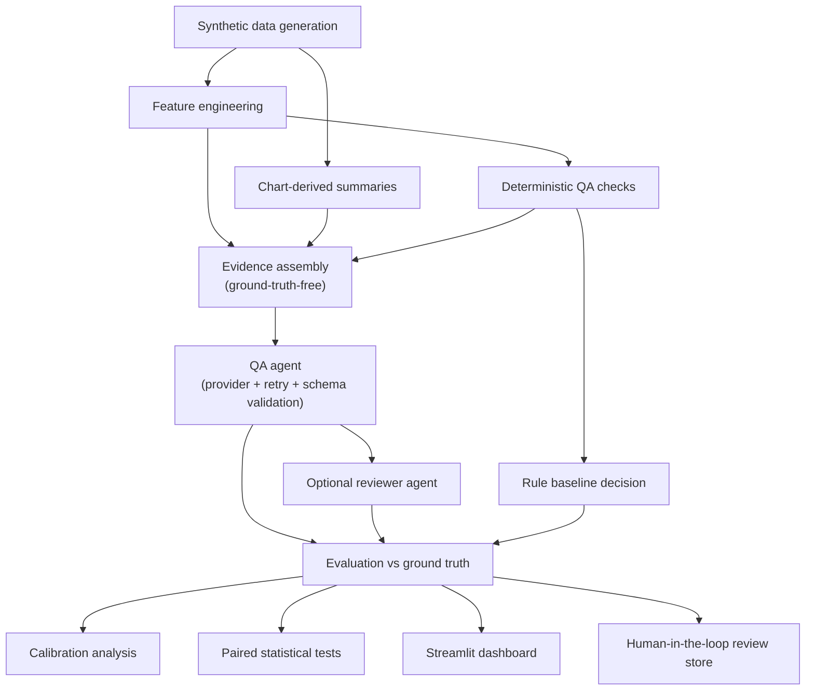

# Agentic AI Evaluation and Monitoring Platform

## 1. Abstract

This study investigates the reliability, calibration, failure modes, and
human-review dynamics of LLM-based agents performing structured
model-monitoring quality-assurance (QA) tasks. We construct a synthetic setting
in which quarterly model-monitoring statistics are reviewed to identify potential
anomalies, and we evaluate a schema-constrained QA agent against labelled ground
truth and a transparent deterministic baseline. The platform supports controlled
comparisons across prompt variants, deterministic-evidence settings, and a
second-pass reviewer agent, together with calibration analysis, paired
statistical testing, ablations, and a human-in-the-loop review interface. All
results reported here are produced by an offline deterministic **mock** provider
and are simulation rather than measurements of any real model; the mock exists so
that the full evaluation methodology can be exercised and reproduced without any
API access. The repository also implements Anthropic and OpenAI providers for
optional live-model experiments.

## 2. Motivation

Analysts reviewing model-monitoring metrics must distinguish genuine anomalies
from expected movements (seasonality, definitional rebasing, recovery) and from
noise (small samples, high volatility). Naive magnitude thresholds are known to
produce both false alarms and missed shifts. This study asks whether an
LLM-based QA agent can assist with that review reliably, how its behaviour
changes under different prompt and evidence configurations, and where human
verification remains necessary.

## 3. Research questions

- **RQ1** Does providing deterministic QA evidence improve agent precision,
  recall, and evidence grounding?
- **RQ2** How do zero-shot, few-shot, and evidence-constrained prompts affect
  anomaly detection, unsupported claims, and output consistency?
- **RQ3** Does a second-pass reviewer agent reduce false positives, unsupported
  claims, and severity misclassification?
- **RQ4** How well calibrated are the agent's confidence scores?
- **RQ5** Which anomaly types and scenario conditions produce the highest
  false-positive and false-negative rates?
- **RQ6** How frequently do human reviewers disagree with deterministic rules and
  agent judgments?
- **RQ7** What tradeoffs emerge between quality, latency, token usage, and
  estimated cost?
- **RQ8** How does missing, noisy, or contradictory evidence affect agent
  reliability and abstention behaviour?

## 4. Hypotheses

- **H1 (RQ1)** Supplying deterministic QA evidence increases precision and
  reduces the unsupported-claim rate, with a smaller effect on overall decision
  correctness.
- **H2 (RQ2)** Evidence-constrained and conservative prompts reduce the
  unsupported-claim rate and false-positive rate relative to a zero-shot prompt.
- **H3 (RQ3)** A reviewer agent reduces the false-positive rate and flags
  unsupported claims, at additional latency and token cost.
- **H4 (RQ4)** Model-reported confidence is imperfectly calibrated, with
  measurable expected calibration error.
- **H5 (RQ5)** Trap scenarios (expected large movements; masked shifts) produce
  the highest false-positive and false-negative rates for the deterministic
  baseline.
- **H6 (RQ8)** Incomplete evidence increases the abstention rate and reduces
  recall.

These hypotheses are evaluated *within the synthetic mock setting*; confirmation
there is a property of the documented generative and mock processes, not evidence
about any real model.

## 5. Experimental setting

A case is a single (model, metric, segment) reviewed at the final quarter of a
short quarterly history. Each case is assigned a labelled scenario. The agent
receives engineered features, a chart-derived summary, and (optionally)
deterministic QA findings, and must return a strict JSON finding. Outputs are
scored against ground-truth labels and compared to a deterministic rule baseline.

## 6. Synthetic dataset

The generator (`src/data_generation.py`) produces 600 cases across 8 fictional
models, 12 quarters, 5 metrics (`psi`, `auc`, `ks_statistic`, `default_rate`,
`score_mean`), and 3 segments, covering all 15 scenario categories and 4
difficulty levels. Anomaly prevalence is ≈0.53. Labels are deliberately not
recoverable from any single field: the best single-threshold |z-score| F1 on the
full dataset is ≈0.70. False-positive traps carry large movements but are *not*
anomalies; false-negative traps carry genuine but masked shifts. Per-scenario
generation is documented in `data/labeled_scenarios.json`. Ground-truth fields
are excluded from all agent inputs and a leakage assertion enforces this.

## 7. Agent architecture



The agent assembles a ground-truth-free evidence block, renders a prompt from a
named variant, calls a provider with a bounded retry loop, and validates the
returned JSON against a strict Pydantic schema (`AgentFinding`). The schema
requires evidence items, confidence, evidence-sufficiency, unsupported-claim
risk, a human-review flag, and an explicit abstention field.

## 8. Deterministic baseline

`src/deterministic_checks.py` implements transparent, independently testable
checks (absolute percent change, z-score, robust z-score, missing rate, small
sample, consecutive drift, volatility increase, cross-segment inconsistency,
expected-direction and cross-metric contradictions, seasonal/definition-change
warnings, and a recovery distinction). The baseline anomaly decision is
deliberately magnitude-driven and trap-unaware; over the full dataset it attains
P≈0.58, R≈0.59, F1≈0.59, and scores near zero on false-positive traps and
metric-definition-change cases. It is a baseline, not ground truth.

## 9. Prompt conditions

Four prompt variants are stored in `config/prompts.yaml`: **A** zero-shot,
**B** few-shot, **C** evidence-constrained (requires every conclusion to cite
supplied evidence), and **D** conservative (optimised for abstention and low
false positives). Prompt text is centralised in YAML and never duplicated across
Python modules.

## 10. Reviewer-agent condition

An optional second-pass reviewer (`src/reviewer_agent.py`) inspects the first
finding and the supplied evidence, verifies evidence support, flags unsupported
claims and contradictions, and may revise the severity or decision. It returns a
strict `ReviewerOutput`.

## 11. Evaluation methodology

`src/evaluators.py` computes accuracy, precision, recall, specificity, F1,
false-positive/negative rates, balanced accuracy, severity accuracy and confusion
matrix, abstention and selective accuracy, schema-compliance, evidence
completeness, recommendation actionability, an unsupported-claim analysis,
confidence statistics, calibration error, Brier score, and latency/token/cost
aggregates. Metrics are computed overall and by scenario type, difficulty,
prompt, and condition.

## 12. Calibration methodology

`src/calibration.py` computes reliability curves, expected calibration error
(count-weighted gap between confidence and accuracy), Brier score, and
over/under-confidence rates. Confidence is model-reported and treated cautiously:
calibration measures whether a stated confidence corresponds to empirical
decision accuracy, not that confidence is a true probability.

## 13. Statistical analysis

`src/statistical_tests.py` provides nonparametric bootstrap confidence intervals,
McNemar's test for paired binary correctness, paired permutation tests, Cohen's h
and paired Cohen's d effect sizes, and Benjamini-Hochberg correction. Method
selection is documented at each call site in `src/reporting.py`. P-values are
always accompanied by effect sizes and, where applicable, confidence intervals,
and are corrected for multiple comparisons across the RQ family. Observational
comparisons are not interpreted causally.

## 14. Experimental results

All results below are from the offline mock provider (`mock_main` grid, 16
conditions, 600 cases) and are simulation. Numbers are reproduced by
`python -m src.reporting`; the canonical tables live in `outputs/` and
`reports/research_summary.md`.

Mean metrics by prompt variant (`mock_main`):

| prompt | precision | F1 | FPR | unsupported-claim rate | abstention | ECE |
|---|---|---|---|---|---|---|
| zero-shot (A) | 0.566 | 0.554 | 0.464 | 0.208 | 0.032 | 0.158 |
| few-shot (B) | 0.579 | 0.560 | 0.441 | 0.088 | 0.060 | 0.149 |
| evidence-constrained (C) | 0.582 | 0.555 | 0.427 | 0.047 | 0.059 | 0.133 |
| conservative (D) | 0.570 | 0.539 | 0.431 | 0.037 | 0.082 | 0.147 |

- **RQ1**: with deterministic evidence, precision rises (0.557→0.591) and the
  unsupported-claim rate falls (0.099→0.091); the paired McNemar contrast of
  decision correctness is small but detectable (accuracy 0.558 vs 0.533,
  BH-adjusted p<0.001). Consistent with H1.
- **RQ2**: the zero-shot vs evidence-constrained unsupported-claim rate falls
  0.204→0.045 (paired difference 0.158, Cohen's h≈0.51, permutation p<0.001,
  BH-adjusted p<0.001). Consistent with H2.
- **RQ3**: pre→post reviewer false-positive rate falls 0.209→0.200 and accuracy
  rises 0.545→0.552 (McNemar BH-adjusted p<0.001); the reviewer flags unsupported
  claims without rewriting the first agent's text. Partially consistent with H3.

## 15. Failure analysis

`outputs/aggregate_metrics.json` (`by_scenario`) records per-scenario error
rates. The deterministic baseline fails most on false-positive traps and
metric-definition-change cases (it always flags the large movement) and on
masked false-negative traps. The Failure Analysis dashboard page enumerates false
positives, false negatives, schema failures, unsupported claims, high-confidence
errors, and rule-agent disagreements per condition.

## 16. Human-review analysis

`src/review_store.py` stores analyst decisions in SQLite and computes acceptance,
rejection, revision, and disagreement rates, including agent-human and rule-human
disagreement. The dashboard's Case Review page records decisions; the Human
Review page summarises them.

## 17. Limitations

- All reported results are simulation under a documented mock process and do not
  estimate any real model's behaviour.
- The mock's prompt sensitivity is parameterised, so prompt-variant differences
  reflect those parameters rather than emergent model behaviour.
- The deterministic baseline, peer-based cross features, and the surface-pattern
  unsupported-claim detector are documented approximations.
- The synthetic dataset is case-structured rather than a dense panel, so
  cross-segment and cross-metric features are approximate.

## 18. Threats to validity

- *Construct validity*: anomaly labels are defined by the generator; "anomaly"
  is operationalised within this synthetic process.
- *Internal validity*: condition comparisons are paired by case, but the mock's
  behaviour is parameterised, so observed differences are associations under the
  mock, not causal model effects.
- *External validity*: findings do not transfer to real models or real
  monitoring data without live-model replication.
- *Evaluator bias*: the optional LLM-as-judge is secondary and never replaces
  ground-truth metrics; self-preference and judge-model effects are possible.

## 19. Responsible-AI considerations

The system enforces evidence-based conclusions and an explicit
observation-versus-hypothesis distinction, requires uncertainty and abstention,
flags cases for human review, versions prompts and models, logs provenance, and
uses only synthetic data. The agent is positioned as an assistant to analyst
judgement and never as a replacement. Automation bias, overconfident
classification, and false-positive consequences are discussed in the research
summary.

## 20. Reproducibility

Every condition records its configuration, seed, git commit, dependency
versions, and resource usage (`outputs/run_manifest.json`). The dataset and all
experiment outputs regenerate deterministically from fixed seeds.

## 21. Repository structure

```
agentic-ai-evaluation-platform/
├── README.md, requirements.txt, pyproject.toml, .env.example, .gitignore, app.py
├── config/        prompts.yaml, evaluation.yaml, experiments.yaml
├── data/          synthetic_monitoring_data.csv, labeled_scenarios.json, dataset_metadata.json
├── src/           data_generation, schemas, feature_engineering, deterministic_checks,
│                  chart_summaries, llm_providers, agent, reviewer_agent, evaluators,
│                  calibration, statistical_tests, experiment_runner, review_store, reporting, utils
├── tests/         8 pytest modules (run without any API)
├── notebooks/     exploratory_analysis.ipynb
├── outputs/       experiment_results.csv, case_level_results.jsonl, aggregate_metrics.json,
│                  calibration_results.csv, sample_agent_outputs.json, run_manifest.json
└── reports/       research_summary.md
```

## 22. Setup

```bash
python -m venv .venv && source .venv/bin/activate
pip install -r requirements.txt
```

## 23. Running mock experiments

```bash
python -m src.data_generation        # regenerate the synthetic dataset
python -m src.experiment_runner      # run the mock_main and mock_ablation grids
python -m src.reporting              # regenerate reports/research_summary.md
```

## 24. Running live-model experiments

Live experiments are optional and require credentials. Install the provider SDKs
(`pip install anthropic openai`), copy `.env.example` to `.env`, set the relevant
key, and define a grid with `provider: ["anthropic"]` or `["openai"]` (see the
`live_example` block in `config/experiments.yaml`). Live runs incur API cost and
are never executed by default.

## 25. Running the dashboard

```bash
pip install streamlit plotly
streamlit run app.py
```

## 26. Running tests

```bash
python -m pytest
```

The test suite runs entirely offline and does not require any API key.

## 27. Repository structure of outputs

`outputs/experiment_results.csv` (one row per condition), `case_level_results.jsonl`
(one row per case per condition), `aggregate_metrics.json` (nested metrics with
per-scenario and per-difficulty breakdowns), `calibration_results.csv` (per-bin
reliability), `sample_agent_outputs.json` (labelled mock samples), and
`run_manifest.json` (provenance).

## 28. Future research

- Live-model replication across Claude and OpenAI models with paired comparison
  to the mock predictions.
- Multimodal evidence (chart images) and its effect on grounding.
- Richer panel structure enabling exact cross-segment and cross-metric tests.
- Stronger unsupported-claim adjudication combining model-based and human labels.
- Cost-aware routing between single-agent and reviewer-agent configurations.
